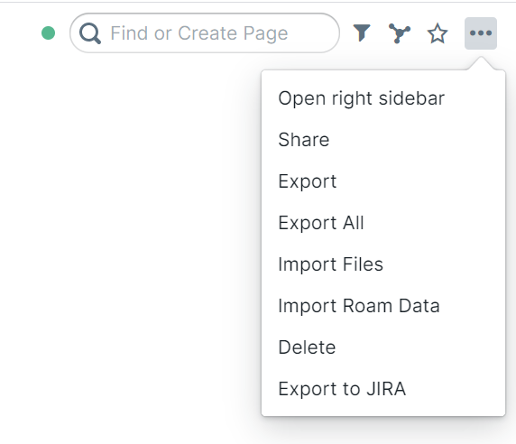

# roam_JIRA_export



Javascript code block that exports the current Roam page to JIRA text format and copies it to the clipboard. Currently supports:

* ```
    code blocks
  ``` 
* :white_check_mark: TODO entries
* `inline` code
* images :sunrise_over_mountains:

To use, follow the guide here to add a new javascript code block to your graph: https://roamresearch.com/#/app/help/page/ezKbtrHNF
Then, add the contents of `contentScript.js` into the new code block: https://github.com/adnissen/roam_jira_export/blob/master/contentScript.js

After running the block, the "..." menu in the upper-right of Roam will have a new "Export to JIRA" option.
